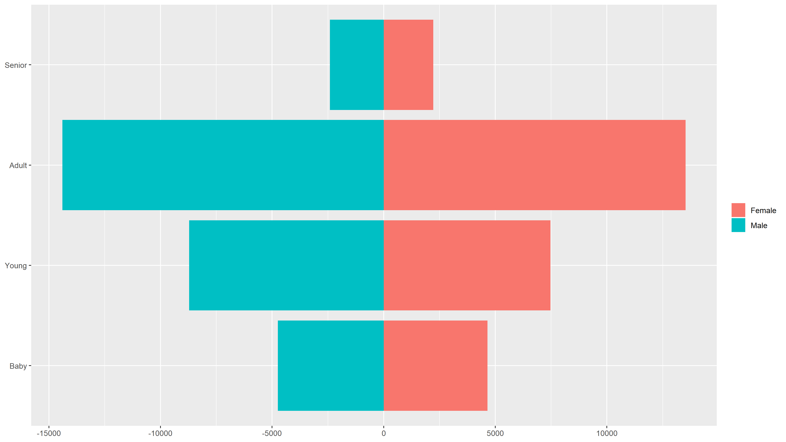
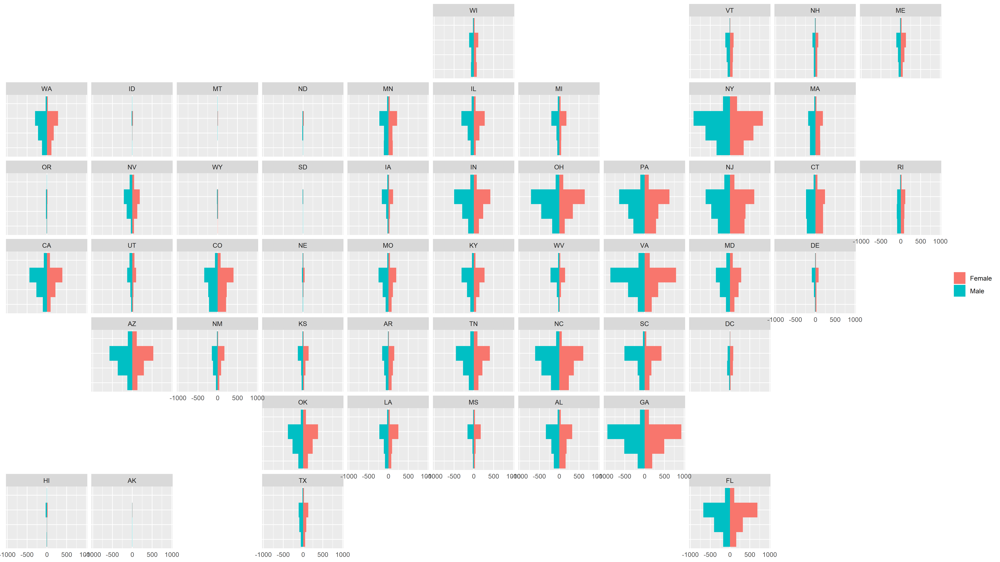

# Adoptable Dogs

Made with R, ggplot2, geofacet and dplyr.

Data source: https://github.com/rfordatascience/tidytuesday/tree/master/data/2019/2019-12-17
My original tweet: https://twitter.com/nfauco/status/1207046364057735171

